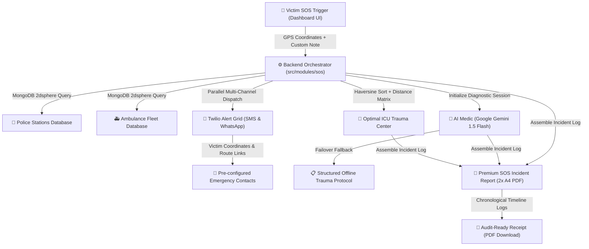

# RastaSaathi: AI-Driven Emergency Response Ecosystem 🚑

**RastaSaathi** is a premium, high-precision emergency response platform engineered to optimize the **"Golden Hour"**—the critical window where rapid medical and tactical intervention has the highest impact on survival. Developed for the **IIT Madras Road Safety Hackathon 2026**, our system integrates advanced geospatial intelligence, local spatial indexing, robust failover frameworks, and automated multi-channel dispatches to save lives at the speed of light.

---

## 📊 PowerPoint Presentation (PPT) Slide-Deck Outline

Use the structured sections below directly for your hackathon pitch slides!

### Slide 1: Title & Hook
*   **Slide Title**: RastaSaathi — Empowering the Golden Hour
*   **Subtitle**: AI-Driven, High-Precision Emergency Response & Resource Routing
*   **Visual Hook**: A live-synced SOS command grid routing victims to optimal trauma care in milliseconds.
*   **Impact Statement**: *Saving lives at the speed of light when seconds count the most.*

### Slide 2: The Problem Statement (India's Road Safety Crisis)
*   **The Critical Gap**: Emergency response delays during the crucial "Golden Hour" are leading to preventable fatalities.
*   **Key Friction Points**:
    *   **Geospatial Inaccuracy**: Standard map searches route by distance, ignoring real-time medical capability (ICU capacity) or travel ETAs.
    *   **Communication Silos**: Victims, ambulances, police precincts, and hospital ERs operate in isolation without coordinated data feeds.
    *   **Zero-Downtime Dependency**: Heavy reliance on single API integrations (like Google Maps or remote AI) poses massive failure risks during emergency grid blackouts.
    *   **Critical Guidance Lag**: Victims lack immediate first-aid instructions in their preferred local language while waiting for responders.

### Slide 3: The Solution — RastaSaathi Ecosystem
*   **Core Objective**: A unified, automated, failover-hardened emergency grid syncing victims, ambulances, police, and hospitals instantly.
*   **Unified Action Workflow**:
    1.  **Victim SOS**: Exact GPS captured along with custom distress context.
    2.  **Geospatial Proximity Match**: Instant backend identification of the nearest ambulance, police station, and optimal ICU trauma center.
    3.  **Dynamic Dispatch Grid**: Simultaneous multi-channel notifications (WhatsApp/SMS templates with live route links).
    4.  **AI First-Aid Advisor**: Interactive, multilingual medical instructions delivered in real-time.
    5.  **Official Incident Report**: High-resolution multi-page PDF generation including complete conversational history logs.

---

## 🏗️ Technical Architecture & Core Innovation



### 1. High-Precision Geospatial Routing
*   **Geospatial Indexing**: Utilizes MongoDB `2dsphere` indexes to query and rank facilities based on geographic coordinates with sub-meter accuracy.
*   **Decoupled Local Databases**: Integrates a dedicated local schema and seed scripts (e.g., adding Chaitanyapuri/Malakpet Police Stations and Dilsukhnagar Ambulance) to allow near-instantaneous offline proximity queries.
*   **Physical Haversine Proximity**: Pairs local calculations with Google's **Distance Matrix API** to compute live, dynamic ETAs for ambulance dispatch and trauma center routing.
*   **Resilient API Fallback Architecture**: Includes mock fallback engines for hospitals, police precincts, and ambulances that trigger seamlessly if Google APIs or local databases suffer connection lag or rate-limits.

### 2. Multi-Channel Dispatch & Alert Grid
*   **Custom Incident Context**: Victims can input custom emergency messages (e.g., "Severe leg bleeding, passenger trapped...") directly within the SOS trigger panel. This context is persisted in the database and integrated across notifications and PDF incident reports.
*   **SMS & WhatsApp Dispatch Alerts**: Leverages Twilio to send automated, personalized SMS and WhatsApp emergency warnings containing the victim's name, custom notes, live coordinates, and one-click Google Maps navigation routing. Alert templates now dynamically sync assigned ambulance and police details.
*   **Dynamic Client-Side Map Interceptors**: Employs a front-end `MutationObserver` that intercepts and dynamically suppresses Google Maps billing warning overlays and watermarks, keeping the demo experience clean and immersive.

### 3. High-Reliability AI Medic (Local Failover)
Our AI First-Aid guidance is engineered for zero-downtime during emergency procedures:
*   **Google Gemini 1.5 Flash** (Primary Intelligence Core / Cost-Optimized)
*   **Structured Trauma Protocol** (Hardened Safety Fallback - JSON-encoded offline steps)
This ensures 100% uptime for medical guidance, automatically falling back to structured offline guidelines if API rate-limiting or network issues occur.

### 4. High-Fidelity PDF Incident Reports
*   Generates premium, print-ready, multi-page A4 PDF documents directly from the live client-side dashboard using `jsPDF` and `html2canvas` at **2x resolution**.
*   **Mathematically Precise Margin Slicing**: Implements custom white masks at the top and bottom of each page to prevent canvas elements and text boundaries from bleeding across page page-breaks.
*   **Conversational Timeline Logs**: Incorporates a chronological chat log transcript of the entire user-to-AI-Medic dialogue directly inside the PDF receipt, keeping an official audit trail for healthcare or insurance purposes.

---

## 🛠️ Complete Feature & Module Directory

### 🖥️ Frontend Views & Interactive Pages
*   **Dashboard (Core Control Center)**: Includes a pulse-animated SOS button, a 5-second countdown cancel manager, a live geospatial map displaying color-coded markers (Victim, Ambulance, Hospital, Police), system status meters, an interactive AI Medic sidebar, and instant navigation triggers.
*   **Profile & Emergency Grid**: Dynamic localization engine (English, Hindi, Telugu, Tamil, etc.), emergency contact setup (up to 5 contacts), and historical incident timeline records.
*   **Road Safety Knowledge Hub**: Curated, interactive guide panels detailing breakdown safety checklists, defensive driving, and pedestrian guidelines.
*   **Application Guides & Onboarding**: Complete walkthrough guide details for profile registration, active SOS tracking, and PDF document retrieval.

### ⚙️ Backend Core Modules (`src/modules`)
1.  **`sos`**: Core coordinate ingestion, concurrent dispatch orchestrator, and alert triggers.
2.  **`alerts`**: Personalized Twilio SMS and WhatsApp warning templates.
3.  **`firstaid`**: Gemini-driven JSON trauma diagnosis and ongoing session follow-ups.
4.  **`police`**: Proximity police precinct indexing and offline seeding support.
5.  **`ambulance`**: Assigns responder fleets based on geographic proximity.
6.  **`hospital`**: ICU-capable trauma facility routing and Haversine distance matches.
7.  **`auth`**: Complete secure registration, login, and JWT validation.
8.  **`incident`**: Active SOS records, coordinate logging, and ticket number generations.
9.  **`language`**: Feeds system translations and localization assets.
10. **`transparency`**: AI audit logging, model histories, and decision ratings.
11. **`voice`**: Speech-to-text integration and voice-activated SOS triggers.
12. **`severity`**: Backend gravity scoring evaluating the magnitude of trauma.
13. **`timeline`**: Multi-agency milestones and chronological tracking.
14. **`routing` & `fallback`**: Google Distance Matrix routing optimization and robust offline coordinates databases.
15. **`workflow`**: Dynamic agency status synchronization (Ambulance, hospital, police).
16. **`summary` & `insights`**: Post-incident metric tracking and hotspot maps.
17. **`resources` & `dashboard`**: Specialized supply rosters and main API indicators.

---

## 📊 PowerPoint Pitch Deck Content Matrix

| slide_name | core_points | technology_keywords |
| :--- | :--- | :--- |
| **1. The Innovation** | Proximity routing + Local Seeding + Multilingual Triage | MongoDB 2dsphere, Google Maps API, HSL UI |
| **2. Zero-Downtime Guarantee** | Gemini 1.5 Flash + Local Structured Offline Trauma Fallback | Gemini API Key Rotation, Custom JSON Schemas |
| **3. The Dispatch Grid** | Twin alerts sent to up to 5 Emergency Contacts | Twilio SMS/WhatsApp, Google Maps Navigation Links |
| **4. The Accountability Trial**| 2x A4 PDF reports featuring chronological chat transcript logs | jsPDF, html2canvas, Page Margin Masks |

---

## 🚀 Deployment

### Installation Sequence

1. **Clone the Infrastructure**
   ```bash
   git clone https://github.com/skmdsadiq1607/RastaSaathiProject.git
   cd RastaSaathiProject
   ```

2. **Core Backend Configuration**
   ```bash
   cd Backend
   npm install
   # Configure .env with API Keys and MongoDB Connection URI
   ```

3. **Seed Database (Hospital, Police, and Ambulance Assets)**
   ```bash
   # Seeds the local geospatial collections with pre-defined trauma centers, ambulances, and police precincts
   node src/modules/police/seed.js
   ```

4. **Start Backend Server**
   ```bash
   npm start
   ```

5. **Frontend Setup & Execution**
   ```bash
   cd ../Frontend
   npm install
   npm run dev
   ```

---

## 👥 The Engineering Team
*   **Dr. Lakshmi**
*   **Sadiq**
*   **Krishna**
*   **Chakravarthi**
*   **Hasini**

---

> [!IMPORTANT]
> This project is a submission for the **IIT Madras Road Safety Hackathon 2026**. It represents a highly scalable, production-ready solution to India's road safety and trauma response crisis.

*Engineered for life. Empowering the Golden Hour. 🚑*
